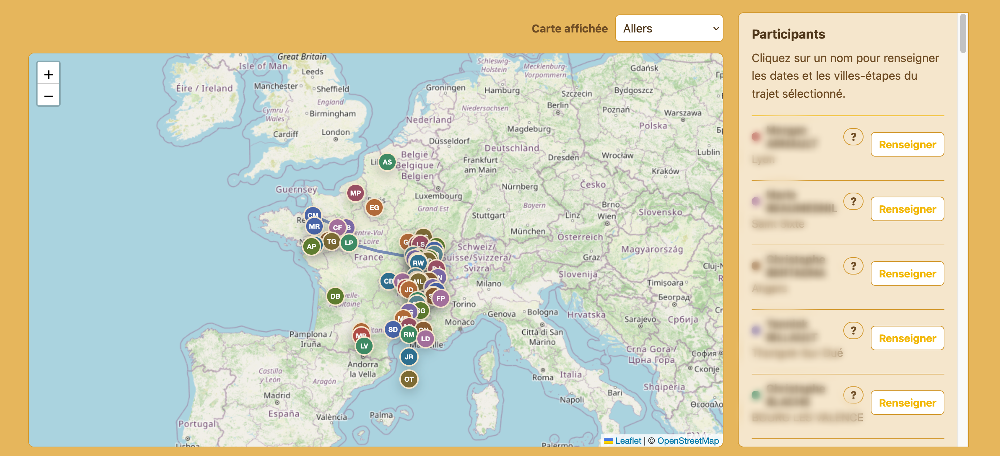
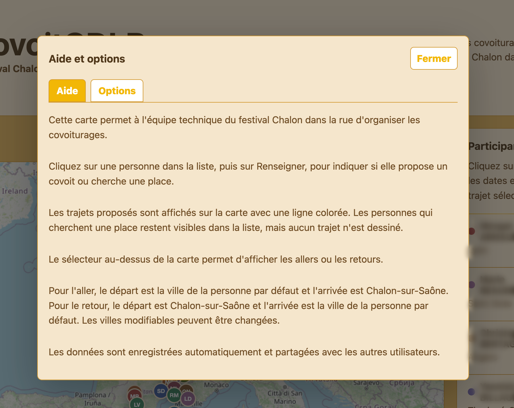

# covoitCDLR


Application web de covoiturage pour l'equipe technique du festival Chalon dans la rue.

covoitCDLR affiche une carte interactive permettant de visualiser les participant-e-s, leurs villes, les annonces de covoiturage et les trajets proposes vers ou depuis Chalon-sur-Saone.

## Captures d'ecran





## Aide utilisateur

Cette carte aide l'equipe technique du festival Chalon dans la rue a organiser les covoiturages.

Chaque personne apparait dans la liste des participants. Les pastilles sur la carte indiquent les villes de depart ou d'arrivee connues. En cliquant sur une pastille, vous voyez la fiche de la personne : nom, prenom, ville et telephone.

Pour renseigner un trajet, choisissez une personne dans la liste puis cliquez sur `Renseigner`.

Vous pouvez indiquer si la personne propose un covoit ou cherche une place. Si elle cherche une place, aucun itineraire n'est dessine sur la carte. Si elle propose un covoit, vous pouvez renseigner la date et les villes-etapes.

Si une ville manque, l'option `+ Ajouter une ville...` ouvre un formulaire de recherche. L'application utilise l'API officielle `geo.api.gouv.fr` pour recuperer les coordonnees GPS, puis enregistre la ville dans Supabase pour tous les utilisateurs.

Le menu au-dessus de la carte permet de passer des trajets aller aux trajets retour.

Pour l'aller, la ville de depart est la ville de la personne par defaut, mais elle peut etre modifiee. La ville d'arrivee est toujours Chalon-sur-Saone.

Pour le retour, la ville de depart est toujours Chalon-sur-Saone. La ville d'arrivee est la ville de la personne par defaut, mais elle peut etre modifiee.

Les trajets proposes apparaissent sur la carte sous forme de lignes continues, avec une couleur differente par personne.

Quand une personne propose un covoit, une annonce est creee automatiquement dans le bandeau avec le format `Prenom Nom propose un trajet vers Ville le jour/mois`. Le bouton `Message` permet de modifier cette phrase par defaut ou de publier une annonce courte, par exemple pour dire que l'on cherche une place. Les annonces actives defilent dans le bandeau sous l'en-tete. En cliquant sur une annonce, vous voyez le message complet et les coordonnees de la personne.

Les trajets et annonces dont la date est passee sont masques automatiquement.

Avec les themes sombres, un potentiometre de luminosite apparait au-dessus de la carte pour assombrir les tuiles OpenStreetMap.

Sur telephone, un bouton permet de basculer entre l'affichage `Carte` et l'affichage `Participants`.

Les informations sont partagees avec les autres utilisateurs grace a Supabase. Apres modification, les donnees sont enregistrees automatiquement.

## Fonctionnalites

- Carte Leaflet basee sur OpenStreetMap.
- Marqueur du festival a Chalon-sur-Saone.
- Pastilles participants avec initiales.
- Popup participant avec nom, prenom, ville et telephone.
- Decalage visuel des pastilles quand plusieurs participants partagent une meme ville.
- Gestion separee des trajets aller et retour.
- Statuts : non renseigne, propose un covoit, cherche un covoit.
- Villes-etapes ajoutables ou supprimables.
- Ajout de villes depuis l'interface avec recherche GPS via `geo.api.gouv.fr`.
- Lignes de trajet continues, colorees par participant.
- Bandeau d'annonces defilant sur ordinateur et telephone.
- Message automatique quand une personne propose un covoit.
- Popup de detail pour consulter une annonce et les coordonnees de contact.
- Masquage automatique des trajets et annonces passes.
- Synchronisation des trajets avec Supabase.
- Synchronisation des villes ajoutees avec Supabase.
- Chargement securise des donnees relatives aux technicien-ne-s depuis Supabase via une fonction RPC protegee par mot de passe.
- Themes visuels configurables depuis la fenetre `Options`.
- Potentiometre de luminosite de carte pour les themes sombres.
- Interface responsive ordinateur et telephone.

## Technologies

- Vite
- TypeScript vanilla
- HTML
- CSS
- Leaflet
- OpenStreetMap
- Supabase

Le projet reste entierement cote client. Il n'utilise pas React, Vue, Angular, Bootstrap, jQuery, Python, base de donnees locale, ni framework backend.

## Installation

```bash
npm install
npm run dev
```

## Build

```bash
npm run build
```

La sortie de production est generee dans `dist/`.

## Versions

La version actuelle est definie dans `package.json` et affichee dans l'en-tete de l'application.

L'historique des changements est suivi dans [CHANGELOG.md](CHANGELOG.md).

## Configuration Supabase

Le frontend lit les variables suivantes au moment du build :

```text
NEXT_PUBLIC_SUPABASE_URL
NEXT_PUBLIC_SUPABASE_PUBLISHABLE_KEY
```

Le fichier `vite.config.ts` autorise aussi les variables prefixes en `VITE_`.

Pour GitHub Pages, ces variables peuvent etre ajoutees dans les variables ou secrets GitHub Actions. Le workflow de deploiement les injecte pendant `npm run build`.

## Structure

```text
covoitCDLR/
├── index.html
├── package.json
├── tsconfig.json
├── vite.config.ts
├── public/
│   ├── logo-cdlr.png
│   └── program-icons/
├── src/
│   ├── main.ts
│   ├── participants.ts
│   ├── style.css
│   └── supabaseClient.ts
└── supabase/
    ├── schema.sql
    ├── technicians.sql
    └── fix-get-technicians-function.sql
```

## Donnees privees

Les donnees reelles relatives aux technicien-ne-s ne doivent pas etre versionnees dans Git.

Le dossier `.private/` est ignore par Git et peut contenir des scripts d'import locaux, par exemple :

```text
.private/technicians-import.sql
```

Ne pas publier ce fichier : il contient des informations personnelles.

## Modele de donnees

### Techniciens

La table `public.technicians` contient :

- `id`
- `last_name`
- `first_name`
- `city`
- `latitude`
- `longitude`
- `phone`
- `color`
- `created_at`
- `updated_at`

L'acces public direct a la table est bloque par RLS. L'application utilise la fonction RPC :

```sql
public.get_technicians(access_password text)
```

Cette fonction verifie le mot de passe, puis renvoie uniquement les champs necessaires a l'application.

### Trajets

La table `public.covoit_journeys` contient les trajets saisis :

- `participant_id`
- `journey_mode` : `outbound` ou `return`
- `status` : `unset`, `offer`, `search`
- `date`
- `endpoint_city`
- `steps`
- `message`
- `updated_at`

La cle primaire est composee de :

```text
participant_id + journey_mode
```

Cela permet d'avoir un trajet aller et un trajet retour par personne.

### Villes personnalisees

La table `public.custom_cities` contient les villes ajoutees depuis l'interface :

- `id`
- `name`
- `postal_code`
- `latitude`
- `longitude`
- `created_at`

Ces villes completent la liste integree dans le code et sont partagees entre utilisateurs.

## Architecture frontend

`src/main.ts` contient la logique principale :

- initialisation Leaflet ;
- chargement des donnees relatives aux technicien-ne-s ;
- chargement et sauvegarde des trajets ;
- rendu des marqueurs ;
- rendu des lignes de trajet ;
- rendu de la liste participants ;
- gestion du formulaire ;
- gestion des themes ;
- gestion de la popup d'aide ;
- affichage mobile carte / participants.

`src/participants.ts` contient une liste de demonstration utilisee seulement comme secours en developpement.

`src/supabaseClient.ts` centralise la creation du client Supabase et la detection de configuration.

`src/style.css` contient tous les styles, les themes et les adaptations responsive.

## Gestion des villes

Les villes disponibles pour les trajets sont centralisees dans `cityOptions` dans `src/main.ts`.

Chaque ville doit avoir :

```ts
{
  name: 'Ville',
  latitude: 0,
  longitude: 0,
}
```

L'application dedoublonne les villes avec une cle normalisee : accents, majuscules, tirets et apostrophes sont ignores pour eviter les doublons comme `Nantes` / `NANTES` ou `Saint Etienne` / `Saint-Étienne`.

Si une ville de technicien n'a pas encore de coordonnees dans Supabase, l'application essaie d'utiliser les coordonnees connues dans `cityOptions`.

## Ajouter une nouvelle ville

Depuis l'application, selectionner `+ Ajouter une ville...` dans une liste de villes. Le formulaire interroge `geo.api.gouv.fr`, propose un resultat avec code postal si disponible, puis enregistre la ville dans `public.custom_cities`.

La ville devient ensuite disponible pour tous les utilisateurs.

Pour ajouter une ville directement dans le code, il reste possible de modifier `cityOptions` dans `src/main.ts`, puis de verifier avec :

```bash
npm run build
```

## Pour les geeks

covoitCDLR est une application frontend pure : aucune API backend maison n'est deployee. Le navigateur charge l'application statique construite par Vite, puis communique directement avec Supabase.

Au demarrage, l'utilisateur entre le mot de passe d'acces. Ce mot de passe sert a appeler la fonction RPC `public.get_technicians(access_password text)`, qui renvoie les donnees relatives aux technicien-ne-s si le hash correspond. Les tables privees ne sont pas lues directement par le client.

Les trajets sont stockes dans `public.covoit_journeys`, avec une ligne par participant et par sens de trajet :

```text
participant_id + journey_mode
```

Chaque ligne contient le statut, la date, la ville de depart ou d'arrivee modifiable, les etapes, le message et la date de mise a jour. Quand un trajet passe en `Propose un covoit`, l'application genere un message par defaut si aucun message personnalise n'existe deja.

Les villes ajoutees depuis l'interface sont stockees dans `public.custom_cities`. Elles completent la liste integree dans `cityOptions`.

L'application garde aussi une copie locale dans `localStorage` pour rester reactive et conserver les reglages du navigateur : theme, luminosite de carte, villes et trajets deja charges. Supabase reste la source partagee entre appareils.

Les mises a jour Supabase sont ecoutees en temps reel avec les subscriptions Realtime. Quand un trajet, un message ou une ville est modifie, les autres appareils peuvent actualiser leur affichage sans redeploiement de l'application.

Les lignes de trajet sont dessinees avec Leaflet a partir des coordonnees GPS des villes. Les personnes en statut `Cherche un covoit` gardent leur fiche et leur annonce, mais ne generent pas de trace d'itineraire.

Les trajets et annonces passes sont filtres cote client avec la date du jour. La carte bascule par defaut sur les retours a partir du 23 juillet 2026.

Le bouton `Proposer une amelioration` de l'aide ouvre un mail vers `clementmorel@free.fr`.

## Deploiement GitHub Pages

Le fichier `.github/workflows/deploy.yml` construit l'application avec Vite et publie le dossier `dist/` sur GitHub Pages.

La configuration Vite utilise :

```ts
base: '/covoitCDLR/'
```

Les chemins d'assets publics dans `index.html` doivent donc utiliser `%BASE_URL%` lorsque necessaire, par exemple :

```html

```

## Points d'attention developpeur

- Ne jamais commiter `.private/`.
- Ne pas faire `git add .` sans verifier `git status`.
- Ne pas commiter `node_modules/`, `dist/` ou `.DS_Store`.
- Apres modification TypeScript ou CSS, lancer `npm run build`.
- Apres modification SQL Supabase, executer le SQL dans Supabase : le commit Git ne modifie pas automatiquement la base.
- Les trajets ne sont dessines que pour les personnes en statut `Propose un covoit`.
- Les personnes en statut `Cherche un covoit` restent visibles dans la liste et sur la carte, mais ne generent pas de ligne de trajet.
- Sur mobile, Leaflet doit recalculer sa taille quand on revient a l'affichage carte.

## Evolutions possibles

- Ajout libre de ville avec recherche automatique des coordonnees.
- Nombre de places disponibles.
- Heure de depart et heure de retour.
- Remarques.
- Recherche dans la liste des participants.
- Filtres par statut, ville ou date.
- Import CSV ou Excel.
- Export des trajets.
- Authentification plus robuste.
- Interface d'administration des participants.
